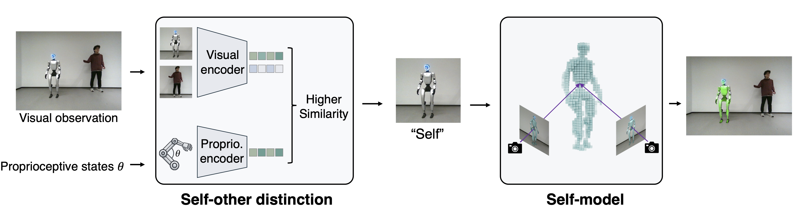

# Humanoid Self-Other Distinction

Official implementation of the paper **"Proprioceptive-Visual Correspondence Enables Self-Other Distinction in Humanoid Robots"**.

<p align="left">
    <a href="https://arxiv.org/abs/2606.13222" target="_blank"></a>
    <a href="https://euron-zc.github.io/humanoid-self-model/" target="_blank"></a>
</p>

## Overview

Distinguishing self from others is a prerequisite for embodied intelligence. Before a humanoid robot can imitate, coordinate, or avoid nearby bodies, it must answer a basic question: **Which body is mine?**

> From several visible bodies, the robot must select the candidate whose configuration matches its proprioceptive state, without identity labels or prior knowledge of its morphology.

We study this problem through proprioceptive-visual correspondence. Given proprioceptive states and visual observations, the framework identifies the robot's own body among humans or similar humanoids, then uses the resulting self-observations to learn a kinematics-free 3D occupancy self-model.

### Framework



The pipeline has two stages:

1. **Self-other distinction** matches proprioceptive states to visual observations to identify the robot's own body.
2. **Self-modeling** learns a 3D body occupancy field from the distinguished self-observations.

## News

- [2026.06] Code coming soon.

## Citation

If you find this work useful, please consider citing:

```bibtex
@article{chen2026proprioceptive,
  title={{Proprioceptive-visual correspondence enables self-other distinction in humanoid robots}},
  author={Chen, Yurun and Gao, Tianyuan and Ge, Yizhong and Ban, Shikun and Wang, Yizhou and Xiong, Hongkai and Zeng, Wenjun and Zhu, Wentao},
  journal={arXiv preprint arXiv:2606.13222},
  year={2026}
}
```

## Contact

For questions or discussions, please contact:
- Yurun Chen: euron.zc@gmail.com

## License

License will be specified upon code release.
